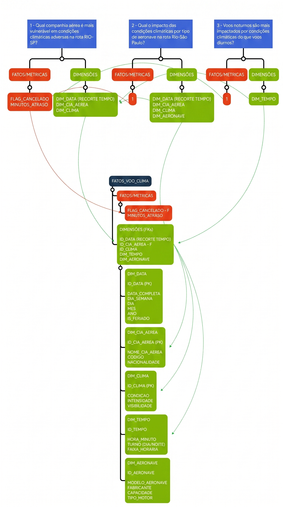

```
Nieuport 17
                          q*p
___________________________T____________________________
      |                 |/(_)\|                 |
      |         -------:**^^^**:-------         |
      |               ((   o   ))               |
    -----------________\\_____//________-----------  -rw
                       /       \
                    TT/         \TT
                    ||-----------||
                    ||           ||
```
*ASCII art by Christopher Johnson*

# ✈️ ETL Pipeline: Impacto Climático na Ponte Aérea (RJ-SP)

## 📌 Visão Geral

Pipeline ETL que cruza dados de voos da ANAC com histórico meteorológico para analisar o impacto de condições climáticas adversas nos cancelamentos nas operações da Ponte Aérea (Rio de Janeiro – São Paulo).

O pipeline extrai dados governamentais brutos, realiza o cruzamento com uma API meteorológica internacional e modela os dados em um Star Schema para responder a perguntas de negócio diretamente ligadas à resiliência operacional das companhias aéreas.

> **Período analisado:** Janeiro de 2024 — mês de verão e historicamente o de maior incidência de chuvas na região Sudeste.

---

## 🛠️ Tech Stack

| Camada | Tecnologia |
|---|---|
| Linguagem | Python |
| Manipulação e Vetorização | Pandas, NumPy |
| Integração Externa | Requests (API REST JSON) |
| Banco de Dados | SQLite in-memory |
| Modelagem | Star Schema com Surrogate Keys |

---

## ⚙️ O Pipeline (ETL)

1. **Extract:** Ingestão do arquivo histórico de voos (VRA) da ANAC e extração dinâmica de dados de precipitação via [Open-Meteo API](https://open-meteo.com/), consumindo as coordenadas dos aeroportos envolvidos (SBSP, SBGR, SBKP, SBRJ, SBGL).

2. **Transform:** Limpeza de dados nulos, vetorização de flags binárias para cancelamentos, criação de surrogate keys e separação do DataFrame principal em dimensões isoladas (`dim_tempo`, `dim_cia_aerea`, `dim_clima`).

3. **Load:** Consolidação da tabela fato unificada e exportação em `.csv` para consumo em ferramentas de visualização ou Data Warehouses.

---

## 🗂️ Modelagem (Star Schema)



> **Nota:** `DIM_AERONAVE` está mapeada no modelo e será implementada na próxima versão com dados simulados.

---

## 📊 Questões de Negócio

O projeto foi construído para responder a três perguntas centrais:

**1. Qual companhia aérea é mais vulnerável em condições climáticas adversas na rota RJ-SP?**
- ✅ Concluído. A Gol Linhas Aéreas registrou a maior taxa de cancelamentos sob condições adversas, com 6,65% dos voos cancelados em dias de chuva ou tempestade. A LATAM Airlines apresentou o melhor desempenho climático do grupo, com 5,28% de cancelamentos no mesmo cenário.

**2. Qual o impacto das condições climáticas por tipo de aeronave?**
- 🗺️ No roadmap. Requer cruzamento com a dimensão de equipamentos — será implementado com dados simulados na próxima versão.

**3. Voos noturnos são mais impactados por condições climáticas do que voos diurnos?**
- ✅ Concluído. O período noturno (18h–05h) se mostrou significativamente mais crítico, registrando taxa de cancelamento de 8,33% — quase o dobro do período diurno (06h–17h), que ficou em 4,76%.

---

## 🚧 Roadmap

- **Granularidade climática:** precipitação atualmente agregada por dia. Um dia com chuva concentrada na madrugada impacta menos a operação da tarde do que o modelo atual reflete. A próxima versão trará cruzamento hora a hora.
- **Modularização:** refatoração do script para módulos separados (`extract.py`, `transform.py`, `load.py`).
- **Resiliência:** implementação de variáveis de ambiente (`.env`) e `try/except` com retries para instabilidades na API.
- **Orquestração:** substituição do SQLite local por um Cloud Data Warehouse e agendamento via Apache Airflow.

---

## 📂 Fontes de Dados

- [ANAC — VRA (Registro de Voos)](https://www.gov.br/anac/pt-br) — Janeiro de 2024
- [Open-Meteo — Historical Weather API](https://open-meteo.com/) — Janeiro de 2024

---

## ▶️ Como Executar

**1. Clone o repositório**
```bash
git clone https://github.com/alexandrecascardi/etl-clima-ponte-aerea.git
```

**2. Instale as dependências**
```bash
pip install -r requirements.txt
```

**3. Adicione o arquivo de dados**

Faça o download do arquivo `VRA_20241.csv` diretamente no portal da ANAC e coloque na raiz do projeto.

**4. Execute o pipeline**
```bash
python pipeline.py
```
